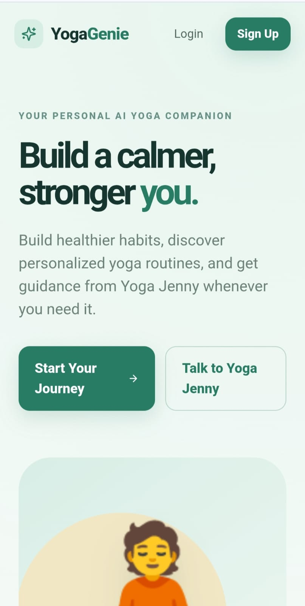
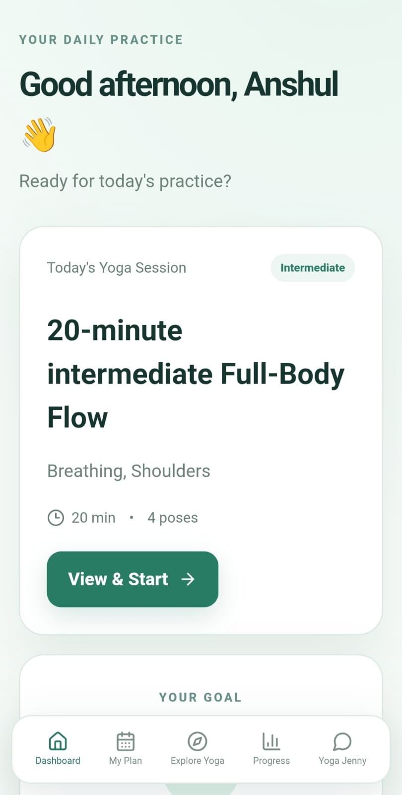
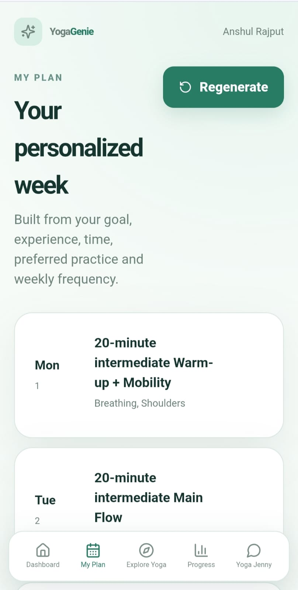
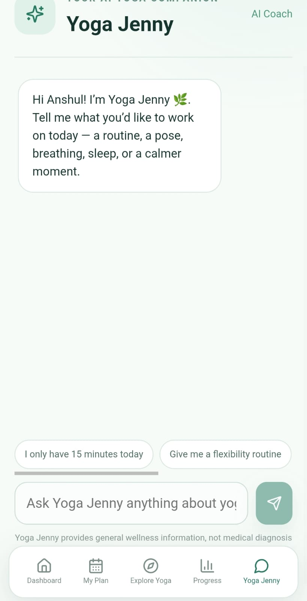
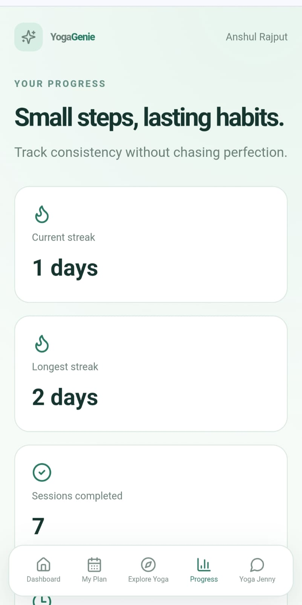

# 🧘 YogaGenie

**Your personal AI-powered yoga and wellness companion.**

YogaGenie is a full-stack wellness platform that combines a **MERN application**, a **Python FastAPI AI service**, personalized yoga planning, progress tracking, and an AI yoga coach called **Yoga Jenny**.

The project is designed to help users discover yoga practices, build personalized routines, track their progress, and interact with an AI assistant grounded in a structured yoga knowledge base.

## ✨ Features

- 🧘 **Personalized Yoga Plans** based on user goals and preferences
- 🤖 **Yoga Jenny AI Coach** for conversational yoga and wellness guidance
- 📚 **Yoga Knowledge Base & RAG Layer** for grounded AI responses
- 👤 **User Authentication** with JWT and password hashing
- 📊 **Progress Tracking** for yoga sessions and streaks
- 🎯 **Goals & Weekly Plans** to support consistent practice
- 🧩 **Modular AI Service** using FastAPI and an LLM provider abstraction
- 🔐 **Security-focused Backend** with Helmet, rate limiting and environment-based secrets
- 🐳 **Docker-ready AI Service**
- ⚙️ **GitHub Actions CI** for frontend, backend and AI-service checks

## 🏗️ Architecture

```text
                         ┌─────────────────────┐
                         │    React Frontend   │
                         │   Vite + Axios       │
                         └──────────┬──────────┘
                                    │
                                    ▼
                         ┌─────────────────────┐
                         │ Node.js + Express   │
                         │ REST API + JWT      │
                         └───────┬───────┬─────┘
                                 │       │
                       ┌─────────▼───┐   │
                       │  MongoDB    │   │
                       │  Mongoose   │   │
                       └─────────────┘   │
                                         ▼
                              ┌─────────────────────┐
                              │ Python FastAPI      │
                              │     AI Service      │
                              └──────────┬──────────┘
                                         │
                              ┌──────────▼──────────┐
                              │ Yoga Jenny AI       │
                              │ LLM + RAG Knowledge │
                              └─────────────────────┘
```

## 📸 Application Preview

### 🏠 Landing Page



### 📊 User Dashboard



### 🧘 Personalized Yoga Plan



### 🤖 Yoga Jenny AI Coach



### 📈 Progress Tracking



## 🧩 Project Structure

```text
YogaGenie/
│
├── frontend/                 # React + Vite frontend
│   ├── components/
│   ├── pages/
│   ├── context/
│   └── ...
│
├── backend/                  # Node.js + Express API
│   ├── config/
│   ├── middleware/
│   ├── models/
│   ├── routes/
│   └── ...
│
├── ai-service/               # Python FastAPI AI service
│   └── app/
│       ├── agents/
│       ├── config/
│       ├── knowledge/
│       ├── models/
│       └── services/
│
├── .github/workflows/        # CI pipeline
├── .gitignore
└── README.md
```

## 🤖 AI & RAG

The AI layer is separated from the main Node.js backend into a dedicated **FastAPI service**.

The AI service includes:

- LLM provider abstraction
- Yoga knowledge data
- Retrieval-oriented service layer
- Conversation context
- Structured request/response schemas
- Safety guidance for wellness-related responses

This separation keeps the AI functionality modular and makes it easier to change or extend the underlying LLM provider.

## 🛠️ Tech Stack

| Layer | Technologies |
|---|---|
| Frontend | React, Vite, React Router, Axios, Context API |
| Backend | Node.js, Express.js, Mongoose |
| Database | MongoDB |
| Authentication | JWT, bcrypt |
| AI Service | Python, FastAPI, Pydantic |
| AI | LLM provider abstraction, RAG knowledge layer |
| Security | Helmet, express-rate-limit, environment variables |
| DevOps | Docker, GitHub Actions |

## 🚀 Local Setup

### 1. Clone the repository

```bash
git clone https://github.com/anshull-rajput/YogaGenie.git
cd YogaGenie
```

### 2. Start the Backend

```bash
cd backend
cp .env.example .env
npm install
npm run dev
```

Configure your MongoDB connection and other secrets in `.env`.

### 3. Start the Frontend

Open a new terminal:

```bash
cd frontend
cp .env.example .env
npm install
npm run dev
```

### 4. Start the AI Service

Open another terminal:

```bash
cd ai-service
python -m venv .venv
```

Windows:

```bash
.venv\\Scripts\\activate
```

macOS/Linux:

```bash
source .venv/bin/activate
```

Then:

```bash
pip install -r requirements.txt
cp .env.example .env
uvicorn app.main:app --reload --port 8001
```

> **Note:** API keys, JWT secrets and database credentials should only be stored in environment variables and must never be committed to GitHub.

## 🔐 Security & Safety

YogaGenie provides **general wellness guidance** and is not intended to diagnose, treat or prevent medical conditions.

Users should stop exercising if they experience pain, dizziness or unusual discomfort and seek qualified professional advice for medical concerns or higher-risk practices.

Production deployments should additionally use:

- HTTPS
- Strong JWT secrets
- Secure secret management
- Restricted CORS origins
- Rate limiting
- Monitoring and centralized logging
- Private/authenticated access to the AI service

## 🧪 Continuous Integration

GitHub Actions currently checks:

- Frontend production build
- Backend JavaScript syntax
- Python AI-service compilation

This helps catch basic build and syntax issues before changes are merged.

## 🔮 Future Improvements

- Deploy the complete application publicly
- Add richer pose/media content
- Improve AI personalization using user progress
- Expand the yoga knowledge base
- Add automated tests for frontend, backend and AI service
- Add production monitoring and observability
- Improve accessibility and mobile experience

## 📌 Project Status

YogaGenie is an actively developed portfolio project focused on **full-stack development, AI integration, RAG concepts, authentication, data persistence and production-oriented application architecture**.

---

⭐ If you find the project interesting, feel free to explore the code and follow the project.
